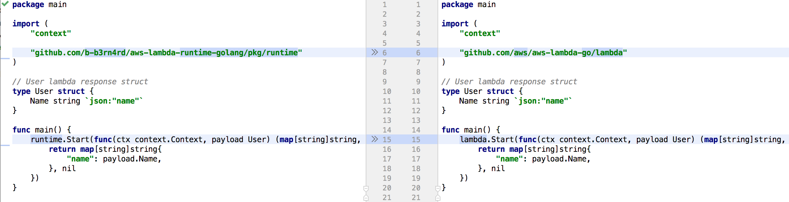

AWS Lambda Golang custom runtime
=================================

Golang implementation of AWS Lambda custom runtime API, that allows easily convert existing golang native lambdas into custom runtime.

Workflow
------------
The workflow can be split into following main steps:
1) Sends GET request to `/runtime/invocation/next` to fetch the invocation information
2) Parses response headers to construct Context using Lambda-Runtime-Aws-Request-Id, Lambda-Runtime-Deadline-Ms, Lambda-Runtime-Invoked-Function-Arn, Lambda-Runtime-Trace-Id headers
3) Sends POST request to `/runtime/init/error` if an error has occurred during invocation request
4) Validates and transforms Lambda's handler function using [aws-lambda-go](https://github.com/aws/aws-lambda-go), *thus allowing to use existing handlers*
5) Executes the handler function with Context (assembled from headers) and payload received from step (1)
6) Marshals handler's result using [aws-lambda-go](https://github.com/aws/aws-lambda-go) and sends it to `/runtime/invocation/AwsRequestId/response` or `/runtime/invocation/AwsRequestId/error`, depending on the outcome of the execution.

Example
-------------
Since, the following library is built on top the native [aws-lambda-go](https://github.com/aws/aws-lambda-go) package and inherits the existing handler behaviour
it requires a *single change* for your existing golang lambda handlers.

 

To-Do
-----------------
The approach of using custom runtime instead of native go environment is still under testing. Currently, I'm
observing slightly quicker cold start time, but very similar execution time for the concurrent invocations. Having said that it requires much more thoughtful testing, to answer the question
what's essentially is quicker a RPC call vs 2 HTTP requests.
I would encourage to use following library only as a POC for your current golang lambdas.
